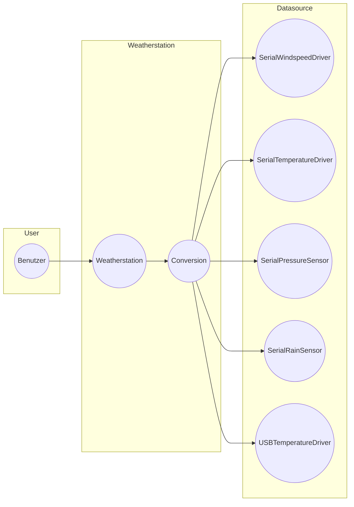
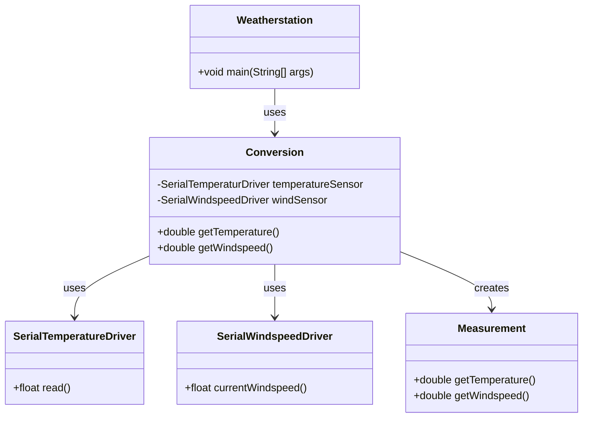
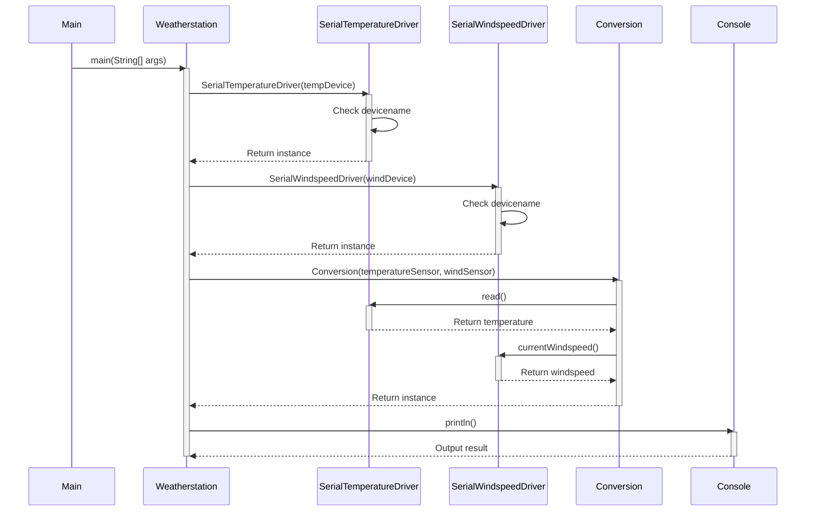

[15:39] Alexander Lunewski / IFWS421B

# Wetterstation

 

## Ansichten

 

### Kontextabgranzung

 

```mermaid

graph LR

    subgraph User

        A((Benutzer))

    end

    subgraph Weatherstation

        B((Weatherstation))

        C((Conversion))

    end

    subgraph Datasource

        D((SerialWindspeedDriver))

        E((SerialTemperatureDriver))

        F((SerialPressureSensor))

        G((SerialRainSensor))

        H((USBTemperatureDriver))

    end

    A --> B

    B --> C

    C --> D

    C --> E

    C --> F

    C --> G

    C --> H

```

 

### Klassendiagramm

 

```mermaid

classDiagram

    class SerialTemperatureDriver{

        +float read()

    }

    class SerialWindspeedDriver{

        +float currentWindspeed()

    }

    class Conversion{

        -SerialTemperaturDriver temperatureSensor

        -SerialWindspeedDriver windSensor

 

        +double getTemperature()

        +double getWindspeed()

    }

    class Measurement{

        +double getTemperature()

        +double getWindspeed()

    }

    class Weatherstation{

        +void main(String[] args)

    }


    Conversion --> SerialTemperatureDriver : uses

    Conversion --> SerialWindspeedDriver : uses

    Conversion --> Measurement : creates

    Weatherstation --> Conversion : uses

```

 

### Sequenzdiagramm

 

```mermaid

sequenceDiagram

    participant Main

    participant Weatherstation

    participant SerialTemperatureDriver

    participant SerialWindspeedDriver

    participant Conversion

 

    Main->>Weatherstation: main(String[] args)

    activate Weatherstation

 

    Weatherstation->>SerialTemperatureDriver: SerialTemperatureDriver(tempDevice)

    activate SerialTemperatureDriver

    SerialTemperatureDriver->>SerialTemperatureDriver: Check devicename

    SerialTemperatureDriver-->>Weatherstation: Return instance

    deactivate SerialTemperatureDriver

 

    Weatherstation->>SerialWindspeedDriver: SerialWindspeedDriver(windDevice)

    activate SerialWindspeedDriver

    SerialWindspeedDriver->>SerialWindspeedDriver: Check devicename

    SerialWindspeedDriver-->>Weatherstation: Return instance

    deactivate SerialWindspeedDriver

 

    Weatherstation->>Conversion: Conversion(temperatureSensor, windSensor)

    activate Conversion

    Conversion->>SerialTemperatureDriver: read()

    activate SerialTemperatureDriver

    SerialTemperatureDriver-->>Conversion: Return temperature

    deactivate SerialTemperatureDriver

    Conversion->>SerialWindspeedDriver: currentWindspeed()

    activate SerialWindspeedDriver

    SerialWindspeedDriver-->>Conversion: Return windspeed

    deactivate SerialWindspeedDriver

    Conversion-->>Weatherstation: Return instance

    deactivate Conversion

 

    Weatherstation->>Console: println()

    activate Console

    Console-->>Weatherstation: Output result

    deactivate Console

 

    deactivate Weatherstation
```

